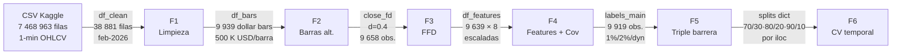
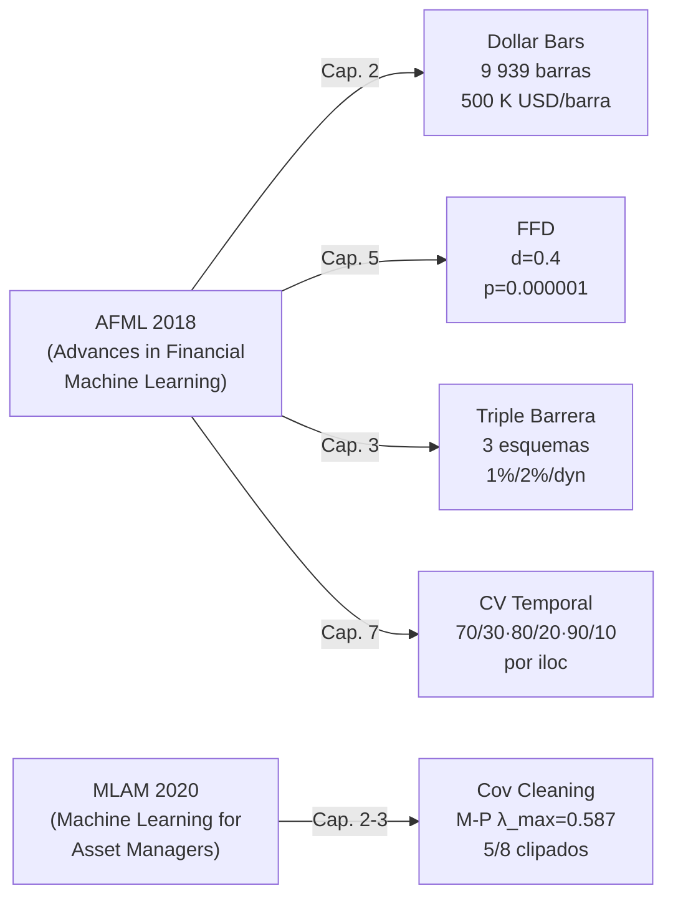

# Defensa oral — Pipeline preprocesado financiero ML
**BTC/USDT · Dollar bars · Febrero 2026 · 1 minuto → 9 939 barras**

---

## Sección 1 — Pipeline y flujo



| Fase | Input | Output | Decisión clave |
|------|-------|--------|----------------|
| F1 Carga/limpieza | CSV 7,47M filas Unix-ts | `df_clean` 38 881 filas, 0 NaN | Filtro `DATE_START/END`; ffill limitado a 5 periodos si hay NaN |
| F2 Barras alternativas | `df_clean` 1-min OHLCV | `df_bars` 9 939 dollar bars | `DOLLAR_THRESHOLD = 500 000 USD`; selección por actividad económica |
| F3 FFD | `df_bars['close']` | `close_fd` d=0.4, 9 658 obs. | `D_ALTERNATIVO=0.4` por equilibrio memoria/estacionariedad frente a `D_OPTIMO=0.2` |
| F4 Features + cov | `df_bars` + `close_fd` | `df_features_final` 9 639×8 + `cov_clean` 8×8 | Marchenko-Pastur λ_max=0.587; 5/8 eigenvalores clipados |
| F5 Triple barrera | `df_bars['close']` | `labels_main` (1%), `df_labels` 3 esquemas | Threshold 1% → mejor balance clases; 2% → 96 % etiquetas 0 |
| F6 CV temporal | `df_bars` + `labels_main` | `splits` dict con 3 cortes iloc | Corte por posición ordinal, no por fecha; sin shuffle |

---

## Sección 2 — Técnicas de López de Prado

#### 1. Barras alternativas (dollar bars) — AFML 2018, Cap. 2

**Problema que resuelve**: las barras temporales equiespaciadas sobreponderar periodos de baja actividad y subponderan periodos de alta actividad, generando retornos heterocedásticos con colas pesadas.

**Implementación**: función `dollar_bars(df, dollar_threshold)` con bucle explícito sobre `df_bars`. Para cada fila se acumula `close × volume` (volumen nocional). Cuando el acumulador supera `DOLLAR_THRESHOLD = 500 000 USD`, se cierra la barra registrando open/high/low/close/volume del grupo y se reinicia el acumulador. El índice de cada barra es el datetime del primer tick del grupo. Resultado: 9 939 barras frente a 40 320 filas temporales originales; distribución de retornos con menor curtosis y asimetría.

**Parámetro clave**: `DOLLAR_THRESHOLD` | 500 000 USD | si sube → menos barras, más representativas pero peor resolución temporal; si baja → más barras, mayor ruido.

**Limitación**: los datos de entrada son barras de 1 minuto, no ticks reales; cada "tick" es ya un agregado, lo que suaviza la irregularidad que las dollar bars están diseñadas para corregir.

---

#### 2. Fixed-Width Window Fracdiff (FFD) — AFML 2018, Cap. 5

**Problema que resuelve**: la serie de precios `close` es I(1) (no estacionaria); diferenciarla entero (d=1) destruye toda la memoria, eliminando información predictiva que los modelos de ML necesitan.

**Implementación**: `get_weights_ffd(d, threshold)` calcula pesos recursivos mediante \(w_0 = 1,\ w_k = -w_{k-1}\frac{d-k+1}{k}\) hasta que \(|w_k| < \texttt{FRACDIFF\_THRESHOLD} = 10^{-4}\). `frac_diff_ffd(series, d, threshold)` aplica la convolución \(\tilde{x}_t = \sum_{k=0}^{l} w_k\, x_{t-k}\) sobre la serie de cierre de `df_bars`. Se prueban d ∈ {0.0, 0.2, 0.4, 0.6, 0.8, 1.0}. El test ADF selecciona `D_OPTIMO = 0.2` (p=0.0044, corr=0.961) y `D_ALTERNATIVO = 0.4` (p=0.000001, corr=0.813). Se usa d=0.4 por mayor robustez estadística, sacrificando ~15 % de correlación con la serie original. Se pierden ~281 filas por la ventana de convolución.

**Parámetro clave**: `d` | 0.4 | si sube → más estacionaria, menos memoria (corr↓); si baja → más memoria, riesgo de no-estacionariedad residual.

**Limitación**: la ventana fija FFD garantiza no look-ahead, pero la selección de d se hace sobre toda la muestra disponible; en producción habría que re-estimar d en cada reentrenamiento.

---

#### 3. Limpieza espectral de covarianza (eigenvalue clipping M-P) — MLAM 2020, Cap. 2-3

**Problema que resuelve**: con N=100 observaciones y p=8 features (γ=p/N=0.08), la covarianza empírica mezcla señal real con varianza muestral espuria; usarla directamente en modelos que dependan de su inversa (mínima varianza, PCA) amplifica el ruido.

**Implementación paso a paso**:
1. `np.linalg.eigh(cov_matrix)` — descomposición de la matriz simétrica en eigenvalores reales y eigenvectores ortonormales; `eigh` es más estable que `eig` para matrices simétricas.
2. Ordenar eigenvalores descendente: λ₁=2.303 > λ₂=1.695 > λ₃=0.796 > … > λ₈=0.015.
3. Calcular límites de Marchenko-Pastur: σ²=mediana(λ)=0.357; λ_max=σ²(1+√γ)²=**0.587**; λ_min=σ²(1-√γ)²=0.184.
4. Clipar: los 5 eigenvalores ≤ λ_max se reemplazan por λ_max; los 3 eigenvalores > λ_max (señal real, 83.6 % de la varianza) se preservan.
5. Reconstruir: `cov_clean = Q @ diag(λ_clipped) @ Q.T`; simetrizar: `(M + M.T)/2` para eliminar errores numéricos de punto flotante.

Norma de Frobenius ||cov_empírica − cov_clean|| = 0.956 (impacto moderado; `rolling_mean` y `atr` son las features más afectadas con diferencia diagonal de −0.556 y −0.442).

**Diferencia con Marchenko-Pastur puro**: en lugar de un percentil ad-hoc, el umbral λ_max se deriva analíticamente de γ y σ², lo que hace el criterio reproducible y fundamentado en teoría de matrices aleatorias.

**Parámetro clave**: `COV_WINDOW` | 100 barras | si sube → γ↓, λ_max más estable, estimación más fiable; si baja → γ↑, más eigenvalores se clasifican como ruido, reconstrucción más agresiva.

**Limitación**: con un solo activo (p=8 features derivadas de BTC), la covarianza captura co-movimiento interno de indicadores correlacionados, no diversificación cross-asset; el clipping es metodológicamente correcto pero su impacto práctico sobre un portfolio de un solo activo es limitado.

---

#### 4. Triple barrera — AFML 2018, Cap. 3

**Problema que resuelve**: el etiquetado por retorno fijo en horizonte H ignora el camino: el precio puede cruzar el stop loss y recuperarse, produciendo una etiqueta +1 engañosa y sesgando el modelo hacia estrategias que toleran drawdowns profundos.

**Implementación**: `get_labels(close, threshold_series, barrier_window)` con `BARRIER_WINDOW=20` barras. Para cada evento i:
- pt = `close[i] × (1 + threshold[i])` — barrera superior (take profit)
- sl = `close[i] × (1 − threshold[i])` — barrera inferior (stop loss)
- Recorre `close[i+1 : i+21]`; asigna +1 si price ≥ pt, −1 si price ≤ sl, 0 si se agota la ventana sin tocar ninguna barrera.

**Tres esquemas comparados**:

| Esquema | threshold | −1 | 0 | +1 |
|---------|-----------|-----|-----|-----|
| Fijo 1% | 0.01 | 18.3% | 65.3% | 16.4% |
| Fijo 2% | 0.02 | 2.2% | 96.2% | 1.6% |
| Dinámico | vol_rolling × 1.5 | 50.5% | 1.1% | 48.4% |

El threshold dinámico (`log_return.rolling(20).std() × 1.5`) invierte la distribución: barreras estrechas en mercados tranquilos generan casi siempre un cruce, minimizando etiquetas 0.

**Parámetro clave**: `BARRIER_WINDOW` | 20 barras | si sube → más oportunidad de tocar barrera, menos etiquetas 0; si baja → más etiquetas 0 (barrera temporal dominante).

**Limitación**: todos los eventos se solapan (todas las barras son entradas); esto introduce correlación serial en las etiquetas, violando la independencia que asume la CV estándar.

---

#### 5. Estacionariedad con memoria — test ADF como herramienta de decisión (AFML 2018, Cap. 5)

*(Integrado con técnica 2; aquí solo la tabla de decisión)*

| d | p-value ADF | Correlación c/ original | Decisión |
|---|-------------|------------------------|----------|
| 0.0 | — (no estac.) | 1.000 | Descartado: I(1) |
| 0.2 | 0.004378 | 0.961 | D_OPTIMO (mínimo d estacionario) |
| 0.4 | 0.000001 | 0.813 | **D_ALTERNATIVO ← seleccionado** |
| 0.6 | <0.000001 | ~0.60 | Más estacionario, menos memoria |
| 1.0 | <0.000001 | ~0.10 | Diferenciación entera, memoria destruida |

Criterio: mínimo d tal que p_ADF < 0.05, preferiendo d=0.4 por mayor margen estacionario (p seis órdenes de magnitud más pequeño que el nivel de significancia).

---

#### 6. Validación cruzada temporal — AFML 2018, Cap. 7

**Problema que resuelve**: el k-fold clásico con shuffle mezcla observaciones de futuro en el entrenamiento. Ejemplo concreto: si la barra 8 000 cae en el fold de train y la 7 999 en test, el modelo aprende patrones que incluyen implícitamente información de los segundos siguientes al periodo de evaluación; los retornos del 1% en dollar bars son autocorelacionados en ventana de 20 barras, amplificando el leakage.

**Implementación**: corte único por `iloc` en tres ratios:
```
split_70 → train = df[:int(0.70*n)], test = df[int(0.70*n):]
split_80 → train = df[:int(0.80*n)], test = df[int(0.80*n):]
split_90 → train = df[:int(0.90*n)], test = df[int(0.90*n):]
```
Se usa `iloc` (posición ordinal) en lugar de corte por fecha para garantizar proporciones exactas independientemente de huecos temporales o distribución irregular de barras.

**Por qué no sklearn `TimeSeriesSplit`**: `TimeSeriesSplit` genera k folds con ventana creciente (walk-forward), útil para evaluar estabilidad del modelo en el tiempo, pero requiere reentrenar k veces. Los splits únicos aquí definidos son suficientes para una primera evaluación y más interpretables para comparar el efecto del tamaño del periodo de entrenamiento.

**Extensión más robusta**: Purged k-fold (AFML Cap. 7) añade un gap de purga entre train y test para eliminar observaciones cuya etiqueta se solapa temporalmente con la ventana de test, resolviendo el leakage introducido por el solapamiento de las ventanas de triple barrera.

**Parámetro clave**: ratio train | 70/80/90 % | ratio mayor → más datos de entrenamiento pero test más corto y menos representativo de condiciones recientes.

**Limitación**: un único corte temporal no detecta inestabilidad del modelo bajo distintos regímenes de mercado (tendencia, lateralidad, volatilidad extrema).

---

### Mapa de técnicas → libros y capítulos



---

## Sección 3 — Checklist del enunciado

| Tarea (20%) | Cómo se cumple | Gráfica que lo evidencia |
|-------------|----------------|--------------------------|
| Dollar/Volume/Tick bars | Tres funciones con bucle explícito; umbrales: TICK=10, VOL=10 BTC, DOL=500 K USD; resultados: 4 032 / 7 983 / 9 939 barras | Comparación visual `close` 4 subplots + distribución retornos + zoom colas |
| FracDiff varios d | `frac_diff_ffd` aplicado a d ∈ {0.0, 0.2, 0.4, 0.6, 0.8, 1.0}; tabla ADF con p-value y correlación; selección D_ALTERNATIVO=0.4 | Series diferenciadas 3×2 + curva correlación vs d con anotaciones |
| Limpieza covarianza | `np.linalg.eigh` → clipping M-P λ_max=0.587 → reconstrucción; 5/8 eigenvalores modificados; norma diff=0.956 | Espectro eigenvalores con límites M-P + heatmap comparativo empírica vs limpia |
| Triple barrera varios thresholds | `get_labels` con threshold_1pct, threshold_2pct y threshold dinámico (vol×1.5); distribuciones {18.3/65.3/16.4%}, {2.2/96.2/1.6%}, {50.5/1.1/48.4%} | Distribución etiquetas 1×3 + serie close con puntos coloreados 3×1 |
| CV temporal varios porcentajes | Cortes por `iloc` en 70/30, 80/20, 90/10; sin shuffle; sin mezcla de índices futuros | Line plot con zonas train/test sombreadas + diagrama de bloques temporal |

---

## Sección 4 — Preguntas de defensa

| Pregunta probable | Respuesta en 2-3 frases |
|-------------------|-------------------------|
| **¿Por qué dollar bars y no time bars?** | Las barras temporales asignan el mismo peso a un minuto con 1 USD negociado que a uno con 1 millón. Las dollar bars normalizan por flujo de capital (close × volume), haciendo que cada barra represente la misma actividad económica. El resultado empírico es una distribución de retornos con menor curtosis y asimetría, más adecuada para modelos que asumen normalidad o estacionariedad. |
| **¿Cómo elegiste el valor de d?** | El criterio automático selecciona el mínimo d con p_ADF < 0.05: en este caso d=0.2 (p=0.0044). Sin embargo, se seleccionó d=0.4 porque su p-value es 0.000001 —seis órdenes de magnitud menor—, lo que da mayor margen frente a posible no-estacionariedad residual, sacrificando un 15 % de correlación con la serie original (0.813 vs 0.961). |
| **¿Tiene sentido limpiar la covarianza con un solo activo?** | Con un solo activo se construyen 8 features internas correlacionadas; la covarianza sigue siendo estimable y el clipping tiene fundamento teórico (γ=0.08 < 1). Sin embargo, el beneficio práctico es limitado porque no hay diversificación cross-asset; la técnica es más valiosa en portfolios con decenas de activos donde γ se acerca a 1. |
| **¿Qué ocurre si dos barreras se tocan en la misma barra?** | En la implementación, el bucle recorre las barras de la ventana en orden cronológico y sale en el primer cruce. Si en una misma barra la barrera superior e inferior se tocan simultáneamente (gap extremo), la comparación `price >= pt` tiene prioridad por estar primero en el condicional; en datos reales de BTC eso es prácticamente imposible en ventanas de 20 dollar bars de 500 K USD. |
| **¿Por qué no usar sklearn `TimeSeriesSplit`?** | `TimeSeriesSplit` genera múltiples folds walk-forward ideales para evaluar estabilidad temporal, pero requiere k reentrenamientos y complica la comparación directa de tamaños de train. Los cortes únicos por `iloc` son más directos para el objetivo del ejercicio: comparar el efecto del ratio de entrenamiento sobre la misma partición cronológica. La extensión correcta es Purged k-fold de AFML Cap. 7, que además purga el solapamiento de etiquetas de triple barrera. |
| **¿Qué mejorarías con más tiempo o datos?** | Tres mejoras concretas: (1) Re-estimar d en cada ventana de reentrenamiento para evitar look-ahead en la selección del d óptimo. (2) Sustituir los splits únicos por Purged k-fold con embargo para eliminar leakage de las ventanas de triple barrera solapadas. (3) Añadir sample weights (método de retornos únicos, AFML Cap. 4) para penalizar observaciones solapadas y reducir el efecto de la correlación serial en las etiquetas. |
