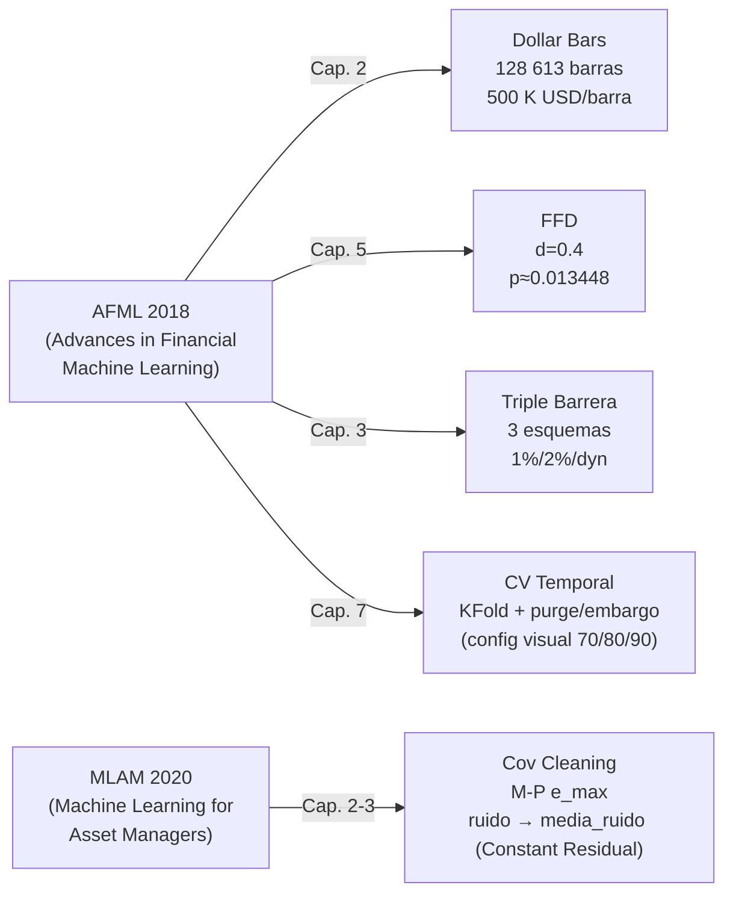

# Defensa oral — Pipeline preprocesado financiero ML
**BTC/USDT · Dollar bars · Ventana 3 años (2023-02-28 → 2026-02-28) · 1 minuto → 128 613 barras**

---

## Sección 1 — Pipeline y flujo

```mermaid
flowchart LR
    RAW["CSV Kaggle\n7 468 963 filas\n1-min OHLCV"]
    F1["F1\nLimpieza"]
    F2["F2\nBarras alt."]
    F3["F3\nCov cleaning\n(parquet wide)"]
    F4["F4\nFeatures + Cov"]
    F5["F5\nTriple barrera"]
    F6["F6\nCV temporal"]

    RAW -->|"df_clean\n1 577 081 filas\nDATE_START→DATE_END"| F1
    F1 -->|"df_bars\n128 613 dollar bars\n500 K USD/barra"| F2
    F2 -->|"precios wide\nrejilla 5-min\np=10"| F3
    F3 -->|"df_features_final\np=10 (estandarizadas)\n+ cov_clean\n10×10"| F4
    F4 -->|"labels_main\n9 919 obs.\n1%/2%/dyn"| F5
    F5 -->|"splits dict\nKFold + purge/embargo\n(config visual 70/80/90)"| F6
```

| Fase | Input | Output | Decisión clave |
|------|-------|--------|----------------|
| F1 Carga/limpieza | CSV 7,47M filas Unix-ts | `df_clean` 1 577 081 filas, 0 NaN | Filtro `DATE_START/END`; ffill limitado a 5 periodos si hay NaN |
| F2 Barras alternativas | `df_clean` 1-min OHLCV | `df_bars` 128 613 dollar bars | `DOLLAR_THRESHOLD = 500 000 USD`; selección por actividad económica |
| F3 Cov cleaning | `data/datos_crypto_limpios.parquet` (wide, 5-min) | `df_features_final` (p=10) + `cov_clean` 10×10 | Subventana últimos 3 años: M-P; ruido (λ ≤ e_max) → `noise_replacement = media_ruido` (Constant Residual) |
| F4 Features + cov | `df_features_final` | `cov_clean` 10×10 | Denoising MP + eigenvalue clipping (Constant Residual): ruido → `media_ruido` |
| F5 Triple barrera | `df_bars['close']` | `labels_main` (1%), `df_labels` 3 esquemas | Threshold 1% → mejor balance clases; 2% → 96 % etiquetas 0 |
| F6 CV temporal | `df_bars` + `labels_main` | `splits` dict construido por folds `KFold(n_splits=...)` | Para cada fold se derivan explícitamente `purge` y `embargo` (según `t1`/horizonte de triple barrera) para evitar solape temporal y reducir leakage |

---

## Sección 2 — Técnicas de López de Prado

#### 1. Barras alternativas (dollar bars) — AFML 2018, Cap. 2

**Problema que resuelve**: las barras temporales equiespaciadas sobreponderar periodos de baja actividad y subponderan periodos de alta actividad, generando retornos heterocedásticos con colas pesadas.

**Implementación**: función `dollar_bars(df, dollar_threshold)` con bucle explícito sobre `df_bars`. Para cada fila se acumula `close × volume` (volumen nocional). Cuando el acumulador supera `DOLLAR_THRESHOLD = 500 000 USD`, se cierra la barra registrando open/high/low/close/volume del grupo y se reinicia el acumulador. El índice de cada barra es el datetime del primer tick del grupo. Resultado: 128 613 barras frente a 1 577 081 filas temporales originales (ventana 3 años); distribución de retornos con menor curtosis y asimetría.

**Parámetro clave**: `DOLLAR_THRESHOLD` | 500 000 USD | si sube → menos barras, más representativas pero peor resolución temporal; si baja → más barras, mayor ruido.

**Limitación**: los datos de entrada son barras de 1 minuto, no ticks reales; cada "tick" es ya un agregado, lo que suaviza la irregularidad que las dollar bars están diseñadas para corregir.

---

#### 2. Fixed-Width Window Fracdiff (FFD) — AFML 2018, Cap. 5

**Problema que resuelve**: la serie de precios `close` es I(1) (no estacionaria); diferenciarla entero (d=1) destruye toda la memoria, eliminando información predictiva que los modelos de ML necesitan.

**Implementación**: `get_weights_ffd(d, threshold)` calcula pesos recursivos mediante \(w_0 = 1,\ w_k = -w_{k-1}\frac{d-k+1}{k}\) hasta que \(|w_k| < \texttt{FRACDIFF\_THRESHOLD} = 10^{-4}\). `frac_diff_ffd(series, d, threshold)` aplica la convolución \(\tilde{x}_t = \sum_{k=0}^{l} w_k\, x_{t-k}\) sobre la serie de cierre de `df_bars`. Se prueban d ∈ {0.0, 0.2, 0.4, 0.6, 0.8, 1.0}. En ventana de 3 años, `d=0.2` no es estacionario (p≈0.1199), mientras que `d=0.4` sí lo es (p≈0.013448) y además conserva alta correlación (corr≈0.990456). Por tanto, `D_OPTIMO = D_ALTERNATIVO = 0.4`: en este caso coinciden (aunque el pipeline mantiene el concepto de D_ALTERNATIVO porque en otros activos/ventanas podría diferir). Se pierden ~281 filas por la ventana de convolución.

**Parámetro clave**: `d` | 0.4 | si sube → más estacionaria, menos memoria (corr↓); si baja → más memoria, riesgo de no-estacionariedad residual.

**Limitación**: la ventana fija FFD garantiza no look-ahead, pero la selección de d se hace sobre toda la muestra disponible; en producción habría que re-estimar d en cada reentrenamiento.

---

#### 3. Limpieza espectral de covarianza (eigenvalue clipping M-P) — MLAM 2020, Cap. 2-3

**Problema que resuelve**: con p=10 activos y una muestra finita de observaciones, la covarianza empírica mezcla señal de co-movimiento real con varianza muestral espuria; al usar su inversión para optimización o PCA, el ruido puede sesgar estimaciones.

**Implementación paso a paso** (en esta versión del notebook):
1. Cargar precios wide desde `data/datos_crypto_limpios.parquet` (rejilla 5-min; columnas = 10 cryptos).
2. Construir la matriz de observaciones como retornos log por activo: `X = np.log(prices).diff().dropna(how="any")`.
3. Estandarizar por columna (StandardScaler) y estimar la covarianza empírica sobre los **últimos 3 años** (subventana temporal usada para construir `df_returns` y, por tanto, para obtener `T` y `N` en `denoise_matrix_mp`).
4. Marchenko–Pastur: con σ²=1 para correlación, se calcula el umbral teórico `e_max` (vía `q=T/N`) que delimita el bulk ruidoso.
5. Denoising (López de Prado / Constant Residual): clasificar como **ruido** los eigenvalores con `λ ≤ e_max` y reemplazarlos por un único valor constante `noise_replacement = media_ruido`, donde `media_ruido` es el promedio de los autovalores ruidosos (bulk). Los eigenvalores de **señal** (`λ > e_max`) se preservan intactos.
6. Reconstruir `cov_clean = Q @ diag(λ_clipped) @ Q.T` y simetrizar con `(M + M.T)/2`.

**Parámetro clave**: la subventana temporal (últimos 3 años) y, por tanto, el ratio `gamma = p/N`. Un N mayor reduce γ y hace la frontera MP más estable.

**Limitación**: el desempeño depende de que el régimen de ruido sea aproximadamente compatible con el supuesto de Marchenko–Pastur; si la ventana temporal se reduce o aumenta p y γ se acerca a 1, el clipping puede volverse más agresivo.

---

#### 4. Triple barrera — AFML 2018, Cap. 3

**Problema que resuelve**: el etiquetado por retorno fijo en horizonte H ignora el camino: el precio puede cruzar el stop loss y recuperarse, produciendo una etiqueta +1 engañosa y sesgando el modelo hacia estrategias que toleran drawdowns profundos.

**Implementación**: `get_labels(close, threshold_series, barrier_window)` con `BARRIER_WINDOW=20` barras. Para cada evento i:
- pt = `close[i] × (1 + threshold[i])` — barrera superior (take profit)
- sl = `close[i] × (1 − threshold[i])` — barrera inferior (stop loss)
- Recorre `close[i+1 : i+21]`; asigna +1 si price ≥ pt, −1 si price ≤ sl, 0 si se agota la ventana sin tocar ninguna barrera.

**Tres esquemas comparados**:

| Esquema | threshold | −1 | 0 | +1 |
|---------|-----------|-----|-----|-----|
| Fijo 1% | 0.01 | 18.3% | 65.3% | 16.4% |
| Fijo 2% | 0.02 | 2.2% | 96.2% | 1.6% |
| Dinámico | vol_rolling × 1.5 | 50.5% | 1.1% | 48.4% |

El threshold dinámico (`log_return.rolling(20).std() × 1.5`) invierte la distribución: barreras estrechas en mercados tranquilos generan casi siempre un cruce, minimizando etiquetas 0.

**Parámetro clave**: `BARRIER_WINDOW` | 20 barras | si sube → más oportunidad de tocar barrera, menos etiquetas 0; si baja → más etiquetas 0 (barrera temporal dominante).

**Limitación**: todos los eventos se solapan (todas las barras son entradas); esto introduce correlación serial en las etiquetas, violando la independencia que asume la CV estándar.

---

#### 5. Estacionariedad con memoria — test ADF como herramienta de decisión (AFML 2018, Cap. 5)

*(Integrado con técnica 2; aquí solo la tabla de decisión)*

| d | p-value ADF | Correlación c/ original | Decisión |
|---|-------------|------------------------|----------|
| 0.0 | — (no estac.) | 1.000 | Descartado: I(1) |
| 0.2 | ≈0.1199 | — | No estacionario (descartado) |
| 0.4 | ≈0.013448 | ≈0.990456 | **D_OPTIMO = D_ALTERNATIVO ← selección final** |
| 0.6 | <0.000001 | ~0.60 | Más estacionario, menos memoria |
| 1.0 | <0.000001 | ~0.10 | Diferenciación entera, memoria destruida |

Criterio: mínimo d tal que p_ADF < 0.05. En esta ventana, el mínimo estacionario es d=0.4 y además coincide con el valor robusto del pipeline (D_ALTERNATIVO).

---

##### 6. Validación cruzada temporal — AFML 2018, Cap. 7

**Problema que resuelve**: el k-fold clásico (con particiones aleatorias) mezcla observaciones de futuro en el entrenamiento. En este pipeline, las etiquetas generadas por triple barrera pueden solaparse temporalmente y, además, existe autocorrelación, lo que puede introducir leakage.

**Implementación (Purged/Embargoed CV)**: en lugar de usar un único corte fijo, se aplica `KFold` sobre índices ordinales (posición en el dataset). Para cada fold “test” se construyen explícitamente los subconjuntos:
- **Purga (purge)**: eventos que empiezan antes del test pero cuyo “tiempo efectivo” (`t1`) cae dentro/afecta la zona del test (evitan solapamiento por horizonte).
- **Embargo (embargo)**: un bloque posterior al test que se excluye del entrenamiento para reducir correlación serial y solape temporal residual.

Esta lógica se implementa con `get_cv_labels_visual(...)` y `get_cv_labels_fixed_proportions(...)`, y se visualiza con:
- `plot_enhanced_cv_proportional(...)` usando **distintos números de folds** para representar configuraciones “70/80/90” (en la práctica: 3, 5 y 10 folds).
- `plot_cv_final_fixed_ratios(...)` para fijar proporciones relativas de purga/embargo.

**Parámetro clave**: el tamaño de entrenamiento “efectivo” cambia con el número de folds (y con el tamaño relativo de purge/embargo), de forma que configuraciones con más folds dejan un test más pequeño y un train más grande, ajustando el compromiso entre representatividad y riesgo de leakage.

**Limitación**: aunque la purga/embargo reduce el leakage por solape temporal, estas particiones visuales no equivalen a un walk-forward reentrenado (tipo `TimeSeriesSplit`) y, por tanto, pueden no reflejar cambios de régimen de forma tan granular.

---

### Mapa de técnicas → libros y capítulos

---

## Sección 3 — Checklist del enunciado

| Tarea (20%) | Cómo se cumple | Gráfica que lo evidencia |
|-------------|----------------|--------------------------|
| Dollar/Volume/Tick bars | Tres funciones con bucle explícito; umbrales: TICK=10, VOL=10 BTC, DOL=500 K USD; resultados: 157 852 / 137 729 / 128 613 barras | Comparación visual `close` 4 subplots + distribución retornos + zoom colas |
| FracDiff varios d | `frac_diff_ffd` aplicado a d ∈ {0.0, 0.2, 0.4, 0.6, 0.8, 1.0}; tabla ADF con p-value y correlación; selección D_ALTERNATIVO=0.4 | Series diferenciadas 3×2 + curva correlación vs d con anotaciones |
| Limpieza covarianza | `np.linalg.eigh` → M-P (σ²=1; umbral `e_max`) → ruido (λ ≤ e_max) reemplazado por `noise_replacement = media_ruido` (Constant Residual) → reconstrucción; cov empírica vs cov_clean | Espectro eigenvalores con límites M-P + heatmap comparativo empírica vs limpia |
| Triple barrera varios thresholds | `get_labels` con threshold_1pct, threshold_2pct y threshold dinámico (vol×1.5); distribuciones {18.3/65.3/16.4%}, {2.2/96.2/1.6%}, {50.5/1.1/48.4%} | Distribución etiquetas 1×3 + serie close con puntos coloreados 3×1 |
| CV temporal varios porcentajes | Particionado por folds `KFold(n_splits=...)`; para cada fold se construyen `purge` y `embargo` para evitar solape temporal (labels de triple barrera) | Visualización de train/test/purga/embargo por fold + diagrama de bloques temporal |

---

## Sección 4 — Preguntas de defensa

| Pregunta probable | Respuesta en 2-3 frases |
|-------------------|-------------------------|
| **¿Por qué dollar bars y no time bars?** | Las barras temporales asignan el mismo peso a un minuto con 1 USD negociado que a uno con 1 millón. Las dollar bars normalizan por flujo de capital (close × volume), haciendo que cada barra represente la misma actividad económica. El resultado empírico es una distribución de retornos con menor curtosis y asimetría, más adecuada para modelos que asumen normalidad o estacionariedad. |
| **¿Cómo elegiste el valor de d?** | Con la ventana de 3 años, el mínimo d que cumple p_ADF < 0.05 es d=0.4: d=0.2 no pasa ADF (p≈0.1199), mientras que d=0.4 sí (p≈0.013448) y mantiene alta correlación (corr≈0.990456). Por eso aquí `D_OPTIMO = D_ALTERNATIVO = 0.4` (aunque el pipeline conserva el concepto de D_ALTERNATIVO porque en otros activos/ventanas podría diferir). |
| **¿Tiene sentido limpiar la covarianza con p=10 activos (cryptos)?** | Sí: la covarianza empírica estimada en una muestra finita es ruidosa y mezcla señal con bulk espurio. Marchenko–Pastur separa ruido vs señal usando el umbral `e_max` (M-P, σ²=1) y el denoising reemplaza el bulk ruidoso con `noise_replacement = media_ruido` (Constant Residual), preservando la señal con λ > e_max. |
| **¿Qué ocurre si dos barreras se tocan en la misma barra?** | En la implementación, el bucle recorre las barras de la ventana en orden cronológico y sale en el primer cruce. Si en una misma barra la barrera superior e inferior se tocan simultáneamente (gap extremo), la comparación `price >= pt` tiene prioridad por estar primero en el condicional; en datos reales de BTC eso es prácticamente imposible en ventanas de 20 dollar bars de 500 K USD. |
| **¿Por qué no usar sklearn `TimeSeriesSplit`?** | `TimeSeriesSplit` genera folds walk-forward reentrenando el modelo en cada etapa. Aquí la comparación se centra en distintas configuraciones de la partición temporal usando `KFold` y construyendo explícitamente `purge`/`embargo` por fold para mitigar el solape de etiquetas de triple barrera (y la autocorrelación), siguiendo la motivación de AFML Cap. 7. |
| **¿Qué mejorarías con más tiempo o datos?** | Tres mejoras concretas: (1) Re-estimar d en cada ventana de reentrenamiento para evitar look-ahead en la selección del d óptimo. (2) Sustituir los splits únicos por Purged k-fold con embargo para eliminar leakage de las ventanas de triple barrera solapadas. (3) Añadir sample weights (método de retornos únicos, AFML Cap. 4) para penalizar observaciones solapadas y reducir el efecto de la correlación serial en las etiquetas. |
